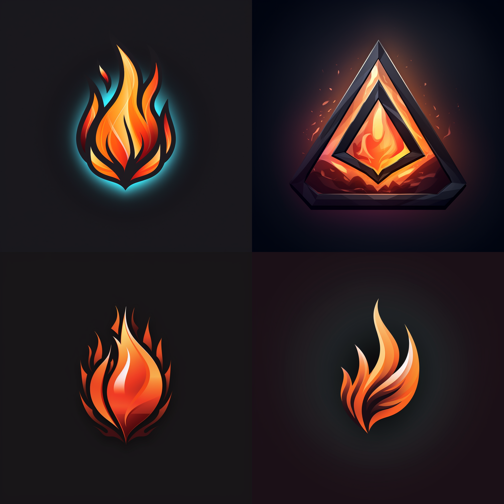
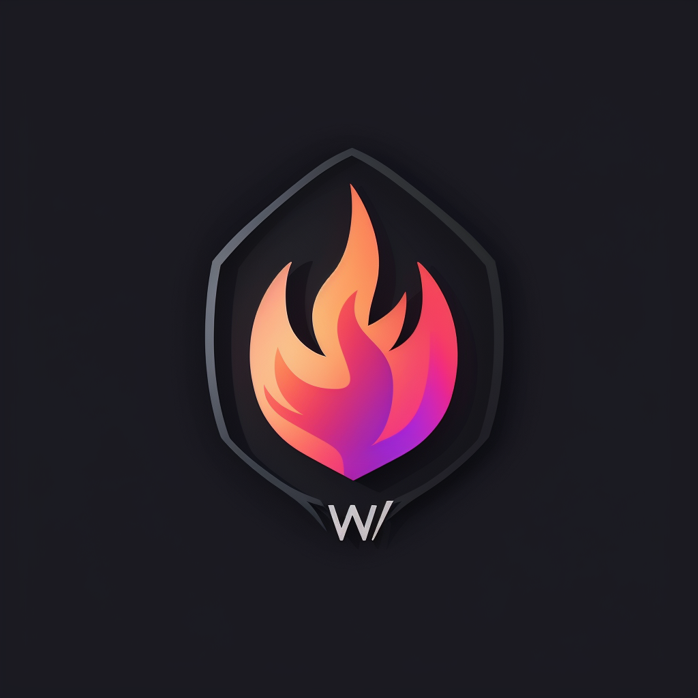

# The Logo

I began with a pretty simple prompt and was very surprised at the immediate quality of the results.

> A proffesional logo for a WAF firewall software product compatible with dark and light mode.

<figure><figcaption>
First round draft. Source: Midjourney.
</figcaption></figure>

I was going for something that was minimalistic and modern with lighter more opaque colours.&#x20;

> A professional and minimalistic logo for a WAF firewall software product that is compatible with dark and light mode.

<figure><figcaption>
First take on final design. Source: Midjourney.
</figcaption></figure>

The final design ended up being a take on the above however with a manual crop to make it look more modular.

<figure><figcaption>
The finisihed article. Source: Midjourney.
</figcaption></figure>
